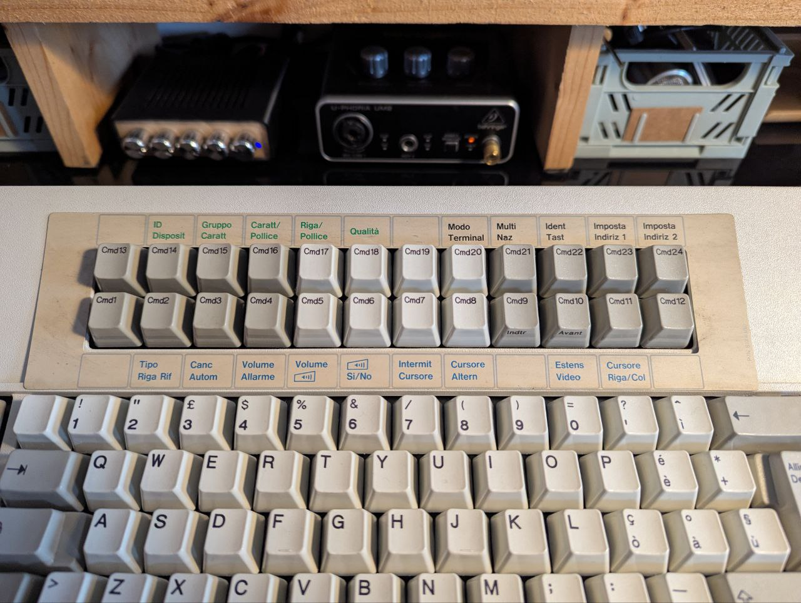
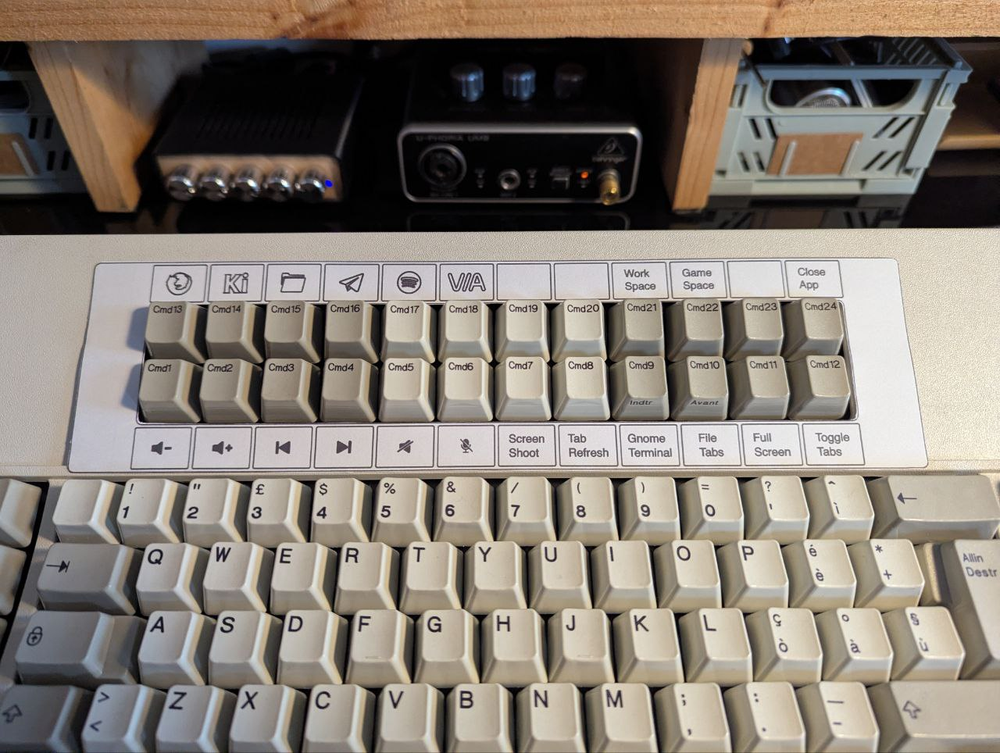

# IBM-M122-Overlay
Vector SVG recreation of the original(?) function key overlay for the IBM Model M 122.

## Preview

## VIA config
### VIA Support
I've included `ibm_terminal_via_config.json`. To use it:
1. Open [VIA Web](https://usevia.app/) (or the desktop app).
2. Go to the **Settings** tab and enable "Show Design tab".
3. In the **Design** tab, click "Load" and select the JSON file from this repo.

## Contents
- `my_card.svg`: The recreated vector file.
- `original-scanned-overlay-italian.pdf`: Scan of the original physical card.
- `card_blank.svg`: A blank template for custom layouts.
